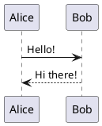
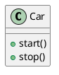

# PlantUML Viewer 🌿

A simple VS Code extension that lets you preview and export PlantUML diagrams right in your editor.

## Features ✨

- **Live Preview**: See your diagrams update as you type
- **Export Options**: Save your diagrams as SVG or PNG
- **Syntax Highlighting**: Makes your PlantUML code beautiful

## Usage 🚀

1. Open a `.puml` file
2. Click the preview icon in the editor title bar
3. Watch your diagram come to life!

## Examples 📝

Create sequence diagrams:

Or class diagrams:

## Installation 📦

1. Open VS Code
2. Go to Extensions (Ctrl+Shift+X)
3. Search for "PlantUML Viewer"
4. Click Install

## License 📄

MIT - feel free to use and modify!
