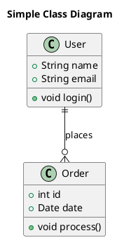

# PlantUML Preview Extension for VS Code

This extension provides PlantUML diagram rendering and preview capabilities directly in Visual Studio Code.

## Features

- **Live Preview**: Preview PlantUML diagrams in a side-by-side webview panel
- **Syntax Highlighting**: Full syntax highlighting for PlantUML files
- **Export Options**: Export diagrams as SVG or PNG
- **Multiple File Types**: Supports `.puml`, `.plantuml`, and `.pu` file extensions
- **Real-time Updates**: Preview automatically updates as you type

## Installation

1. Clone or download this extension
2. Open the folder in VS Code
3. Run `npm install` to install dependencies
4. Run `npm run compile` to build the extension
5. Press `F5` to launch a new Extension Development Host window

## Usage

### Opening a Preview

1. Open a PlantUML file (`.puml`, `.plantuml`, or `.pu`)
2. Use one of these methods to open the preview:
   - Click the preview button in the editor title bar
   - Right-click in the editor and select "Open Preview"
   - Use the Command Palette (`Ctrl+Shift+P` / `Cmd+Shift+P`) and run "PlantUML: Open Preview"

### Exporting Diagrams

- **Export as SVG**: Right-click in the editor and select "Export as SVG"
- **Export as PNG**: Right-click in the editor and select "Export as PNG"

### Configuration

The extension can be configured through VS Code settings:

- `plantuml.server`: PlantUML server URL (default: "https://www.plantuml.com/plantuml")
- `plantuml.previewTheme`: Preview theme - "light" or "dark" (default: "light")

## Supported PlantUML Syntax

The extension supports standard PlantUML syntax including:

- Class diagrams
- Sequence diagrams
- Use case diagrams
- Activity diagrams
- Component diagrams
- State diagrams
- And more!

## Example

Create a file named `example.puml` with the following content:

Then open the preview to see the rendered diagram!

## Requirements

- VS Code 1.74.0 or higher
- Internet connection (for rendering diagrams via PlantUML server)

## Known Issues

- Large diagrams may take some time to render
- Network connectivity required for diagram generation

## Contributing

Feel free to contribute by submitting issues or pull requests!

## License

This extension is provided as-is for educational and development purposes. 