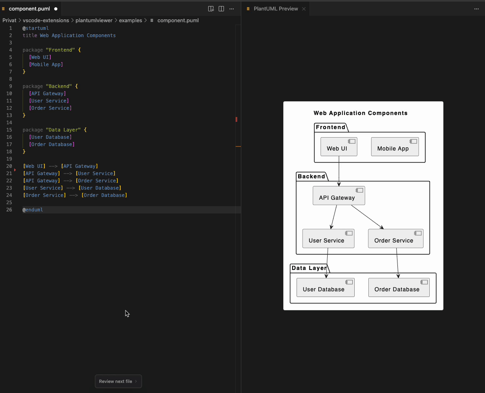

# PlantUML Viewer 🌿

A powerful VS Code extension for previewing and exporting PlantUML diagrams directly in your editor. Perfect for software architects, developers, and anyone who needs to create UML diagrams as code.

## Features ✨

- **Live Preview**: See your diagrams update in real-time as you type
- **Export Options**: Save your diagrams as SVG or PNG with one click
- **Syntax Highlighting**: Makes your PlantUML code beautiful and easy to read
- **Multiple Diagram Types**: Support for sequence, class, component, deployment, and more
- **Context Menu Integration**: Quick access to preview and export options
- **Online Rendering**: Uses PlantUML's online server - no local installation needed

## Usage 🚀

1. Open a `.puml`, `.plantuml`, or `.pu` file
2. Click the preview icon (🔍) in the editor title bar
3. Watch your diagram come to life in the preview panel!

### Export Your Diagrams 📤

Right-click in your PlantUML file and choose:
- "Export as PNG" for bitmap images
- "Export as SVG" for vector graphics

## Requirements 📋

- Visual Studio Code version 1.74.0 or higher
- Internet connection for diagram rendering

## Installation 📦

1. Open VS Code
2. Go to Extensions (Ctrl+Shift+X / Cmd+Shift+X)
3. Search for "PlantUML Viewer"
4. Click Install

## Configuration ⚙️

Access settings through VS Code's settings (Ctrl+,):
- `plantumlviewer.server`: Configure custom PlantUML server URL (default: https://www.plantuml.com/plantuml)

## Support 💬

For issues and feature requests, please contact BenkoSoftware directly.

## License 📄

© 2024 BenkoSoftware. All Rights Reserved.

---

Happy diagramming! 🎨
